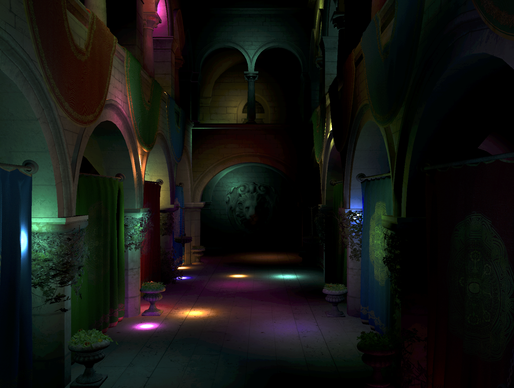
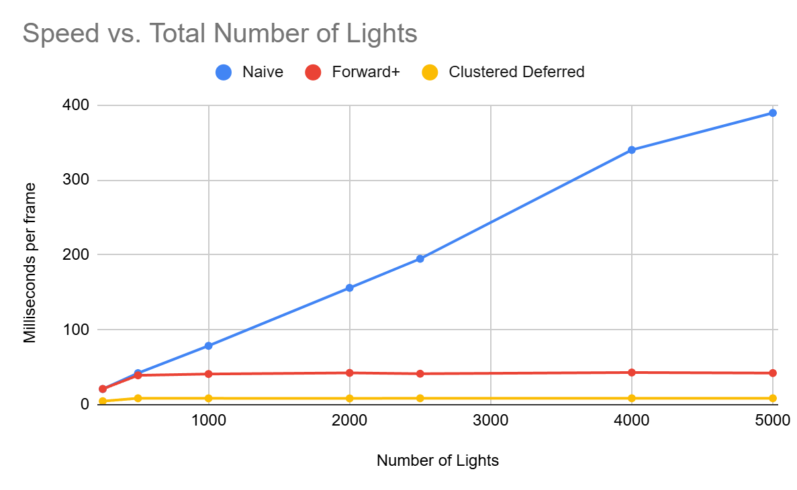
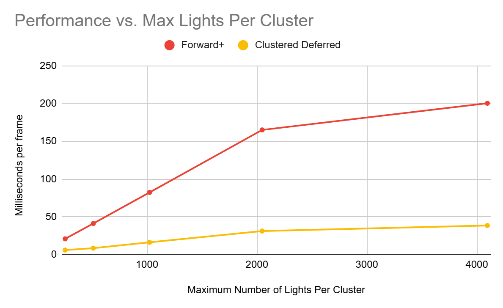
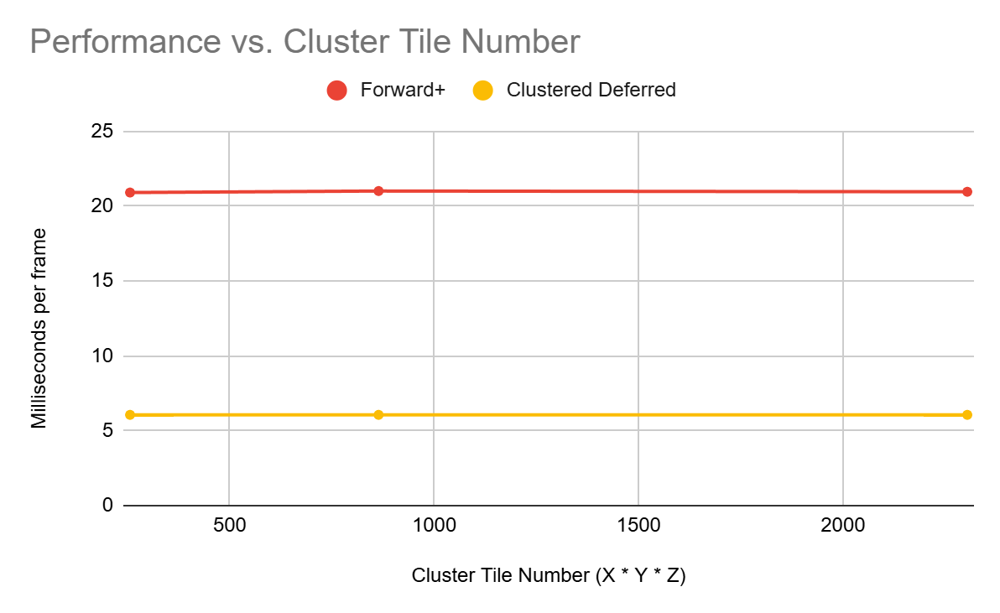

WebGPU Forward+ and Clustered Deferred Shading
======================

**University of Pennsylvania, CIS 565: GPU Programming and Architecture, Project 4**

* Anya Agarwal
  * [LinkedIn](https://www.linkedin.com/in/anya-agarwal/)
* Tested on: **Google Chrome 141.0.7390.55** on
  Windows 11, AMD Ryzen 7 260 @ 380GHz 16GB, RTX 5060

### Live Demo
Click on the image to view the live demo website!

<!--  -->

  

### Demo Video

## Overview

This project involved implementing the Forward+ and Clustered Deferred shading methods, using the WebGPU API. WebGPU allows a browser access to a computer's GPU for more advanced rendering processes. With access to WebGPU compute shaders, the work done before rendering is able to be parallelized by the GPU, allowing for increased speedups. For this project, we are working with a large scene with multiple point lights, and we explore different shading methods to best optimize the process.

### Naive
The naive method involves basic forward rendering of the scene. This involves drawing every pixel of a lit object in the scene, and for every pixel, checking each light to see if it contributes to the pixel. This can get quite slow especially with a large number of lights in the scene, as every single light is being checked for each pixel that is drawn. 

### Forward+
The Forward+ shading method optimizes the naive version by using clustering to limit the number of lights being checked. These cluster shapes are frustums, instead of boxes, as they are aligned with the camera view. After dividing up the camera view into these frustum-shaped clusters, we cull and assign lights to corresponding clusters, which is done in a compute shader. Then, while shading, we can simply just shade based only on the lights affecting each cluster. An interesting thing to note is that when calculating the bounds, the depth is calculated by a log slice instead of a uniform slice to keep it more accurate to how a camera view is realistically set up. Using this method provided a considerable speedup when the number of lights in the scene was increased, as the light culling helps limit the time needed to calculate light contributions. For lower light numbers, the performance is generally the same as the naive implementation, as the light calculations are less expensive. Forward+ can be further optimized by sorting lights by intensity or distance to skip weaker lights, or stream compacting the lights array to lower memory reads.

### Clustered Deferred
The Clustered Deferred method uses a similar light clustering algorithm as Forward+. However, this method optimizes the pipeline of actually shading an object. It involves two passes to render instead of one. The first pass goes through the information in the scene and stores data for each pixel about its position, normal, and albedo vectors. This is all stored in a geometry buffer, or a G-buffer. Then, the second pass uses the clustered light data from the Forward+ algorithm and computes the final lighting, but now while using the newly created G-buffer. By separating these two processes into two pipelines, it reduces a lot of redundant work and overhead. By using a G-buffer, information about the geometry only needs to be calculated once, so it isn't affected by the number of lights in the scene. As expected, this method provides a dramatic speedup from the naive or Forward+ implementations. Even with a lower number of lights, it is considerably faster since the speedup comes from the way that the fragments are shaded as opposed to solely the clustering. Clustered Deferred can be further optimized by reducing the data size of the G-buffer information, or combining shaders into a single compute pass.

## Performance Analysis
For this performance analysis, all values will be given as milliseconds per frame instead of frames per second (FPS). Therefore, lower numbers are preferred as they represent faster speeds.

### Optimizing Code
I used Google Chrome's profiling tools to get insights into how my code is running and where a slowdown might be happening. I found out that the Largest Contentful Paint time is at a good speed, which tells us that the render speed is running fast for the program. However, the Interaction to Next Paint time was quite slow, and was marked for needing improvement. This value measures how long the program takes to visually respond to changes and interactions. I guessed that this could mean that my shaders might be causing slowdowns, since expensive GPU submissions could cause large delays in update times. I optimized my code by trying to avoid branch divergence as much as I could, and trying to avoid expensive operations like `normalize()` and `pow()`. These changes ended up resulting in a very miniscule speedup, but there was somewhat of a speedup nonetheless.

|                      | Forward+ | Clustered Deferred |
| -------------------- | -------- | ------------------ |
| Before Optimizations | 40.72 ms | 8.89 ms            |
| After Optimizations  | 39.21 ms | 8.28 ms            |

### Number of Lights
 

| Number of Lights |   Naive   |   Forward+  |  Clustered Deferred   |
| ---------------- | --------- | ----------- | --------------------- |
| 250              | 20.89 ms  | 21.02 ms    | 4.67 ms               |
| 500              | 42.13 ms  | 39.17 ms    | 8.59 ms               |
| 1000             | 78.57 ms  | 40.96 ms    | 8.49 ms               |
| 2000             | 155.98 ms | 42.45 ms    | 8.39 ms               |
| 2500             | 194.78 ms | 41.34 ms    | 8.59 ms               |
| 4000             | 340.12 ms | 42.96 ms    | 8.59 ms               |
| 5000             | 389.53 ms | 42.21 ms    | 8.59 ms               |

The graph above was created with a constant maximum of 512 lights allowed per cluster. We can visually see the speedups we immediately get when using either Forward+ or Clustered Deferred. The clustered deferred implementation is considerably lower than the other two, and the speed stays relatively level. This shows that the optimizations from this method aren't really affected by the number of lights. For Forward+, it's interesting to note that the speed is similar to the naive implementation until we hit around 500 lights. This is because we are limiting the number of lights per cluster at that amount, so the speed of Forward+ stays level and constant while the naive implementation shoots up linearly.

### Maximum Lights Per Cluster
 

| Max Lights Per Cluster |  Forward+   |  Clustered Deferred   |
| ---------------------- | ----------- | --------------------- |
| 256                    | 20.95 ms    | 6.06 ms               |
| 512                    | 41.23 ms    | 8.59 ms               |
| 1024                   | 82.41 ms    | 16.36 ms              |
| 2048                   | 165.13 ms   | 31.25 ms              |
| 4096                   | 200.43 ms   | 38.59 ms              |

The graph above was created with a constant number of 2500 lights in the whole scene. We can see that changing the maximum number of lights allowed per cluster affects both the Forward+ and Clustered Deferred implementations. This is because we are allowing the clusters to have more lights, which means that there are more lights to iterate through when shading the fragments. As we increase this maximum number, we decrease the optimizations gained from the clustering algorithm, so the performance time increases. 

### Cluster Tile Number
 

| Cluster Tile Number |  Forward+   |  Clustered Deferred   |
| ------------------- | ----------- | --------------------- |
| 256 (8 x 4 x 8)     | 20.91 ms    | 6.06 ms               |
| 864 (12 x 6 x 12)   | 21.01 ms    | 6.06 ms               |
| 2304 (16 x 9 x 16)  | 20.96 ms    | 6.06 ms               |

For the graph above, I tried to change the number of tiles for each cluster by changing the x, y, and z dimensions defined as a constant. However, it seems that changing the cluster tile number keeps the speed relatively constant. This could mean that the actual work being done doesn't really change with the tile number, so the overall speed stays the same.

### Forward+ vs. Clustered Deferred

**Is one of them faster?**

The Clustered Deferred implementation is definitely faster than the Forward+ one for this scene layout, as we see in the graphs above. This is because they both use the same clustering methods, but the Clustered Deferred also incorporated the G-buffer, so there are fewer texture lookups and therefore less work to be done.

**Is one of them better at certain types of workloads? What are the benefits and tradeoffs of using one over the other?**

Clustered Deferred is a lot better with workloads that involve a lot of geometry. The lighting doesn't depend on the number of objects as we compute object information before we do the lighting. However, Forward+ would be better with workloads that have several varying shading models, or other shading information such as translucency. This is because computing all of this extra information into the G-buffer could cause extremely large storage costs. The pipeline of Forward+ also works better for materials where you'd need information per fragment in order to shade other fragments. With this information in mind, one implementation may work better over the other in certain situations. Deferred Clustering provides a greater speedup, but it may be countered by the overhead of other processes to render a scene.

## Credits

- [Vite](https://vitejs.dev/)
- [loaders.gl](https://loaders.gl/)
- [dat.GUI](https://github.com/dataarts/dat.gui)
- [stats.js](https://github.com/mrdoob/stats.js)
- [wgpu-matrix](https://github.com/greggman/wgpu-matrix)
